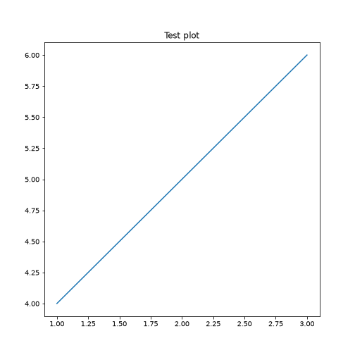
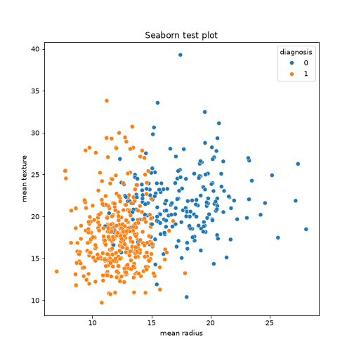

## Test 1: basic Python chunk + package import


``` python
import pandas as pd
print("pandas version:", pd.__version__)
```

``` output
pandas version: 3.0.5
```

## Test 2: matplotlib plot renders in a non-interactive (CI) context

This is the check that matters most for the GitHub Actions build. Specifically headless runners
have no display, so the backend must be set explicitly before any plotting.


``` python
import matplotlib
matplotlib.use("Agg")  # non-interactive backend — required for headless CI/GitHub Actions builds
import matplotlib.pyplot as plt

plt.plot([1, 2, 3], [4, 5, 6])
plt.title("Test plot")
plt.show()
```



## Test 3: the actual workshop dataset loads via scikit-learn


``` python
from sklearn.datasets import load_breast_cancer

data = load_breast_cancer()
print("Shape:", data.data.shape)
```

``` output
Shape: (569, 30)
```

``` python
print("Target names:", data.target_names)
```

``` output
Target names: ['malignant' 'benign']
```

## Test 4: seaborn (used for the pairplot and PCA scatter episodes)


``` python
import seaborn as sns
import pandas as pd

df = pd.DataFrame(data.data, columns=data.feature_names)
df['diagnosis'] = data.target

sns.scatterplot(data=df, x='mean radius', y='mean texture', hue='diagnosis')
plt.title("Seaborn test plot")
plt.show()
```



If all four sections knit without error and show output/plots, the Python + reticulate pipeline
is confirmed working for the actual episode content.
